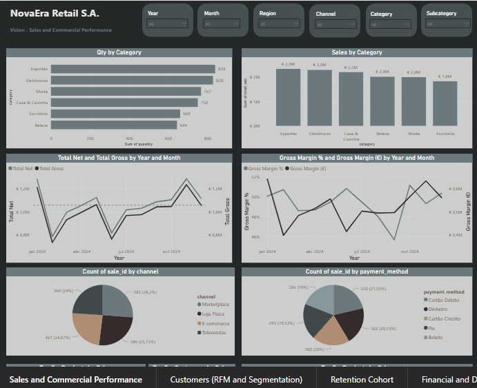
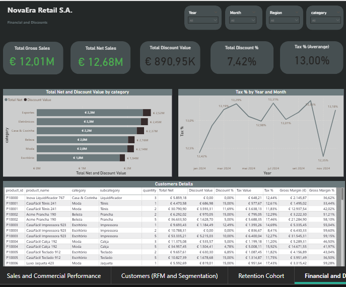

# NovaEra Retail – Business Intelligence Dashboard (Demo)

📊 **Overview**  
This project simulates a fictitious retail company called **NovaEra Retail S.A.**, using synthetic sales, customers, and product data.  
The goal is to demonstrate skills in **Power BI, SQL, and data modeling** applied to a corporate scenario.

---

## 🚀 Features
- **Executive Overview**: Strategic KPIs (Net Sales, Gross Margin, AOV, Orders, Customers).  
- **Sales & Commercial Performance**: Category, channel, and top product analysis.  
- **Customer Analysis (RFM)**: Customer segmentation and ARPU.  
- **Cohort Retention**: Monthly cohort retention matrix and curve.  
- **Financial & Discounts**: Discounts, VAT impact, and profitability metrics.

---

## 🛠️ Tech Stack
- **Power BI** (DAX, Power Query, tabular modeling)  
- **SQL** for fact and dimension table simulation  
- **Excel/CSV** for generating demo datasets  

---

## 📂 Data Structure
- **Fact tables**: `fact_sales`, `fact_customers`, `fact_products`  
- **Dimension tables**: `dim_date`, `dim_region`, `dim_channel`, `dim_category`  

---

## 📸 Preview
  

---

## 🎯 Key Learnings
- Applied **cohort analysis** for retention.  
- Built **financial measures** (Gross Margin, Discount %, Net Sales).  
- Corporate-style layout applicable to real retail companies.  

---

## 📥 File
- [Download Dashboard PDF](NovaEra_Rentail_Demo.pdf)

---

## 👨‍💻 Author
**Leonardo Cabral** – Data Analyst | Power BI | SQL | SAP | Power Platform  
Certification in progress: **Microsoft PL-300**
